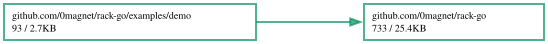

# rack-go

Panel modules laid out the way a physical equipment rack does: side by side,
each one a whole number of slots wide, wrapping into rows and reflowing when one
is taken out. Go/WebAssembly, no dependencies, builds with both the standard Go
toolchain and TinyGo.

```
go get github.com/0magnet/rack-go
```

```go
r := rack.New(rack.Options{
    Container: document.Call("getElementById", "panel"),
    Pinned:    func(key string) bool { return key == "console" },
})

r.Add(oscillatorModule)
r.Add(filterModule)
r.Switches(consoleGrid) // a checkbox per module, to put it away and bring it back
r.Quantize()
```

## What it is, and what it is not

It is **not** a window manager. Windows overlap, are positioned absolutely, and
are arranged by the person using them. A rack is a constraint: nothing overlaps,
everything sits on the same pitch, and taking a module out closes the gap.

The two compose rather than compete. [winbox-go](https://github.com/0magnet/winbox-go)
will dock a window to a screen edge; a rack mounted inside that window is a
control panel. Neither knows about the other:

```go
panel := winbox.New(&winbox.Options{
    Title: "Controls",
    Dock:  winbox.EdgeLeft,
    Mount: r.Root(),
})
```

## Slot quantization

A module is measured, then snapped to the smallest whole number of slots that
holds it. That is what makes a panel of modules with wildly different contents
still line up — module edges land on the same pitch, and corners align across
wrapped rows.

The measurement is the interesting part. A module is first widened out of the
way so its content lays out at its natural size, then measured from the
**positions of the content's own children** rather than from any width property:
a wrapped flex column misreports both `max-content` and `scrollWidth`, and
believing either produces modules that are one slot too narrow and clip.

An N-slot module also spans the N−1 gaps it covers, so its right edge lands
exactly where N separate one-slot modules would end:

```
width = N*slot + (N-1)*gap
```

At the default 132px slot and 4px gap, that is 132, 268, 404, 540 — which is
what a rack of modules holding 3, 12, 6, 24 and 8 controls measures out to.

## Options

| | |
|---|---|
| `Container` | The element the modules live in. Created if unset; place it with `Root()`. |
| `SlotWidth` | The pitch a module's width snaps to, before `Scale`. Default 132px. |
| `Gap` | Space between modules. Must match the stylesheet's gap. Default 4px. |
| `Chrome` | The module's own horizontal padding and borders — what sits between its edge and the measured content. Default 18px. Does **not** scale: a border stays one pixel wide however big the rack is. |
| `Scale` | Multiplies the slot pitch so the whole rack grows together. Also published as the CSS custom property `--rack-scale` on the container, for your own sizing to follow. |
| `ModuleClass`, `HeaderClass` | What the rack's elements are called, so an existing panel can adopt the rack without renaming everything it already styles. |
| `SwitchClass`, `SwitchLabelClass` | The same, for the elements `Switches` builds — a host that already styles its checkboxes gets its own back, not unstyled ones that happen to work. |
| `ContentSelector` | Finds the element inside a module whose span decides its slot count. Default `.rack-grid`. |
| `Pinned` | Reports whether a module may not be hidden. |
| `Fixed` | Turns header-drag reordering off. |
| `OnReorder`, `OnVisibility` | Report what the user changed, by module key, for persisting. |

**Follow `--rack-scale` in your own CSS.** Content that ignores it does not
shrink when the rack does, so it stops fitting the narrower slot and the
quantizer — correctly — hands the module an extra slot, which reads as the scale
control working backwards.

## Show, hide, reorder

Hiding only ever hides. `Show` is an explicit act, never a side effect of a
rebuild: a host that rebuilds its panel when something else changes has its own
reasons for a module being absent, and a visibility pass that helpfully un-hid
everything it did not recognize would fight those reasons every time. Call
`Apply()` after a rebuild to re-hide what was hidden.

`Pinned` exists because a rack whose every module can be put away can be emptied
into a state with no way back. Name the module holding the switches; it gets no
switch of its own.

Reordering is by dragging a module's header into the gap you want it in. Because
a rack reflows, there is nothing to place — a module dropped between two others
simply becomes the module between them. `Order()` and `SetOrder()` persist it.

## Styling

The embedded stylesheet is **structure only** — flex wrap, the module box, the
header strip. No colors, no fonts, no control styling, because a rack that
dictated those would be a theme wearing a layout engine's name. Style your
modules however you like; nothing needs undoing first.

Two numbers in it are not free: the `.rack` gap must match `Options.Gap`, and
`--rack-mod-h` is what makes every module the same height so they tile into rows
instead of bricking.

`CSS()` returns the sheet; `InjectCSS()` adds it once. Supply your own by giving
an element the id `rack-style` before the first rack exists.

## Demo

```
cd examples/demo && ./build.sh && # serve this directory
```

Modules holding 3 to 24 cells, so the quantization is visible: `Envelope` takes
one slot, `Mixer` takes four, and their edges line up with the modules beside
them either way. Scale it, put modules away, drag them around.

## License

None. This is original work with nothing to inherit — it was extracted from
[chaosrack](https://github.com/0magnet/chaosrack), which carries no license
either, and it is not derived from any third-party code. (Its sibling
[winbox-go](https://github.com/0magnet/winbox-go) *is* Apache 2.0, because
WinBox.js is.)

## Dependency Graph

Made with [goda](https://github.com/loov/goda):

```
# GOOS=js: the import edges of a wasm program live in js/wasm-tagged
# files and are invisible to a host-context run
GOOS=js GOARCH=wasm go run github.com/loov/goda@latest graph github.com/0magnet/rack-go/... | dot -Tsvg -o docs/rack-go-goda-graph.svg
```



## Lines of Code

Made with [gocloc](https://github.com/hhatto/gocloc) (excludes `vendor/`, `node_modules/`, `.git/`):

```
gocloc --not-match-d='(vendor|node_modules|\.git)' .
```

```
-------------------------------------------------------------------------------
Language                     files          blank        comment           code
-------------------------------------------------------------------------------
Go                               7            133            300            961
JavaScript                       1             61             36            478
Makefile                         1             21             52            107
Markdown                         1             30              0            102
YAML                             1              0              7             98
HTML                             1              6              0             70
Bourne Shell                     3             19             51             70
CSS                              1              8             21             51
-------------------------------------------------------------------------------
TOTAL                           16            278            467           1937
-------------------------------------------------------------------------------
```
